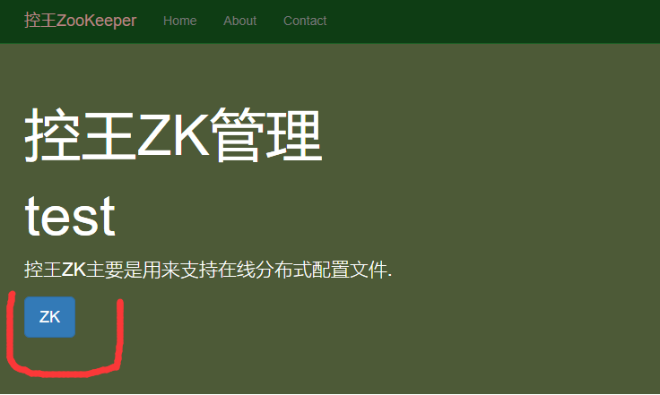
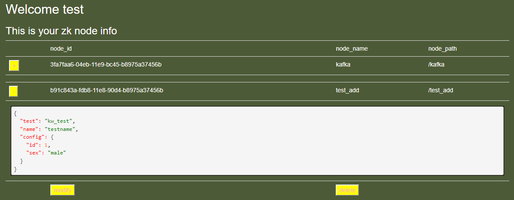

# 控王Zookeeper说明文档

## 用前须知

- 使用前请先注册账户, 如果已有账户则需登录
- 如果没有相关节点权限, 请联系管理员分配node
- 使用前, 如有兴趣可了解Zookeeper帮助你更加熟练使用, [官方文档](https://zookeeper.apache.org/doc/current/index.html)

## Zookeeper使用说明

本项目作为控王科技的config查询系统, 目标是提供一个实时在线更改、查询config的服务. 可以支持一些服务, 
如不重启更改配置修改服务.


### 在线修改配置

登录用户拥有相应节点权限之后就可进行使用相应的节点信息以满足业务需求了

- 首先, 登录账户后, 主页上会有一个`zk`按钮. 
- 点开后就可以看到相应节点存储的信息, 可以选择编辑或者修改. 目前只支持json格式. 

### 获取节点配置的接口

请求地址: /zk_node/

请求格式:
```python
{
    "username": "",         # str类型, 用户名称
    "md5": "",              # str类型, password + timestamp 生成的md5
    "timestamp": 10922435,  # int类型, 生成md5的时间戳
    "zkName": "",           # str类型, 节点名称
}
```

返回格式:
```python
{
    "status": 0,            # int类型, 请求是否成功
    "errMsg": "",           # str类型, 错误信息
    "obj": {},              # json类型, 节点存储的配置信息
}
```

## 负责人

负责人: 单文浩  联系方式: 761542858(QQ)
